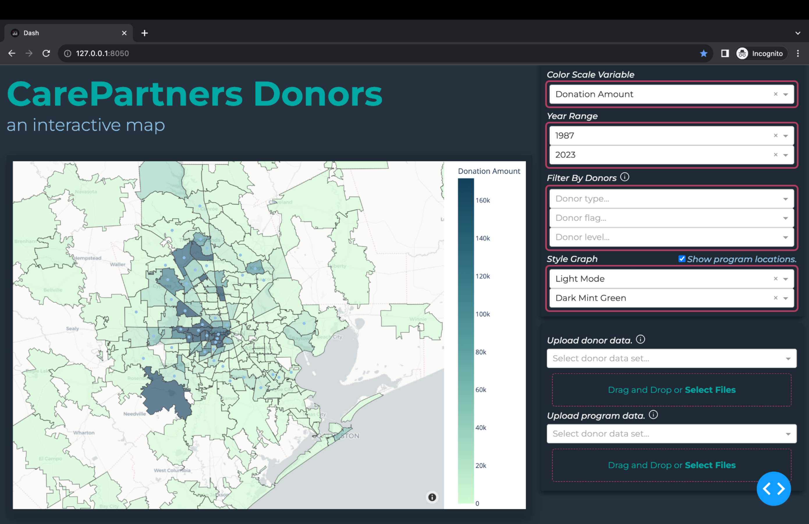
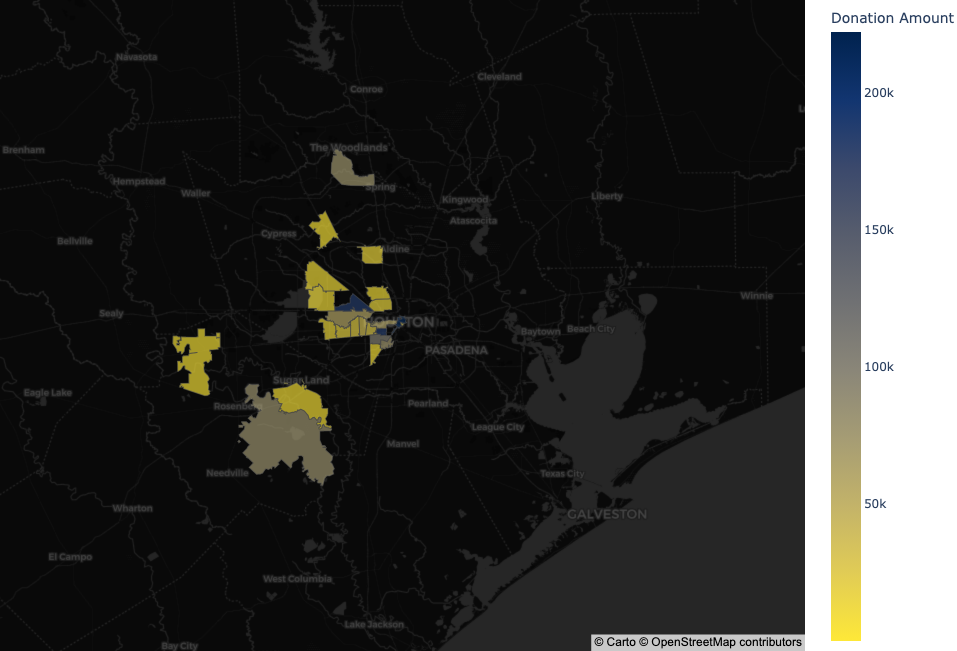
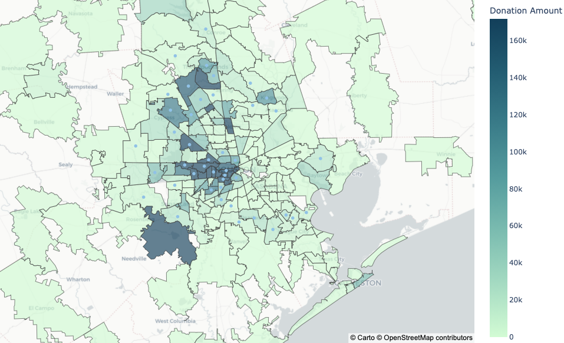
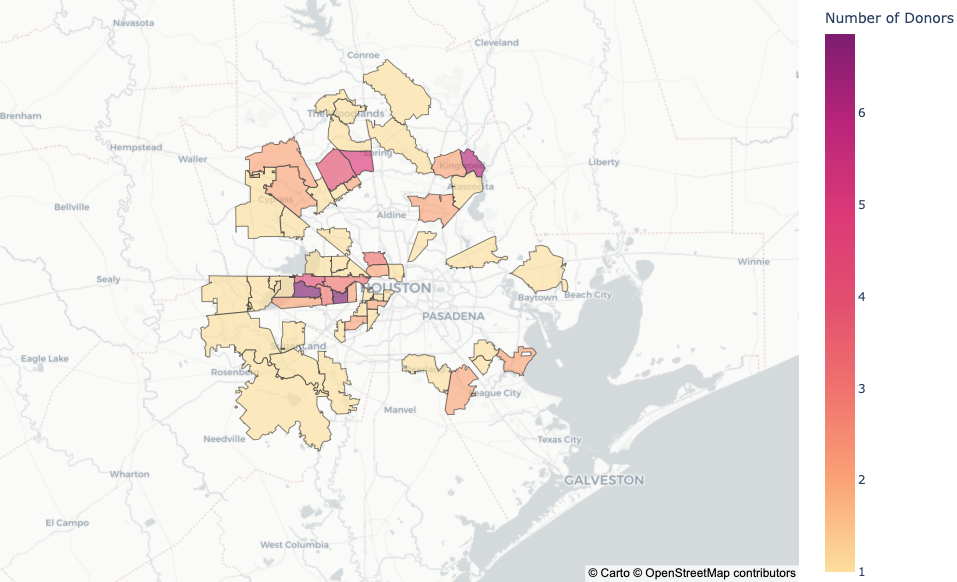
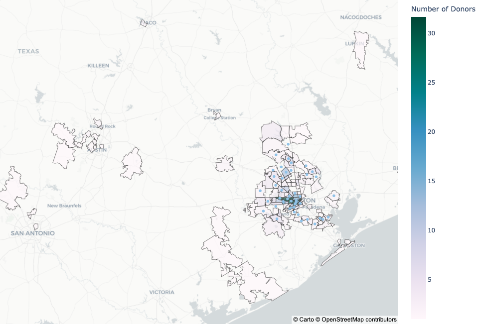

# CarePartners Interactive Donor Map

This Flash-based **Dash** app was designed for CarePartners, a Houston nonprofit serving people with dementia and their caregivers. Using **Pandas** and **Plotly**, over **21,000+ donor records** are analyzed and displayed in an interactive choropleth map of Texas. Various filters can be applied to show important trends in giving. CarePartners staff have the ability to upload new data through the interface due to the application's connection to **MongoDB**.

## Key Features

* Change the color scale variable
    - Donation Amount, Total Donors
* Select year range
* Filter by donor traits
    - Type: Business, Congregation, Foundation, Government, Individual
    - Flag: Board Member, Client, Volunteer
    - Giving Level: Small Gifts, Major Gifts
* Style graph
    - Light/Dark Mode
    - Four color themes
* Choose to show CarePartners program locations
* Hover over zip codes to see donation amount and total donors
* Download static maps
* Upload donor data and program data

## Sample Maps

#### Distribution of Donations of All Time

#### Distribution of Number of Volunteer Donors in 2020-2023

#### Distribution of Donations from Businesses and Foundations in 2020-2023

#### Distribution of Number of Major Gift List Donors of All Time
